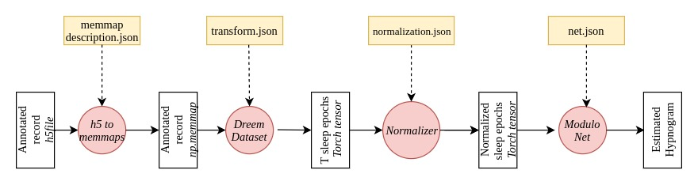
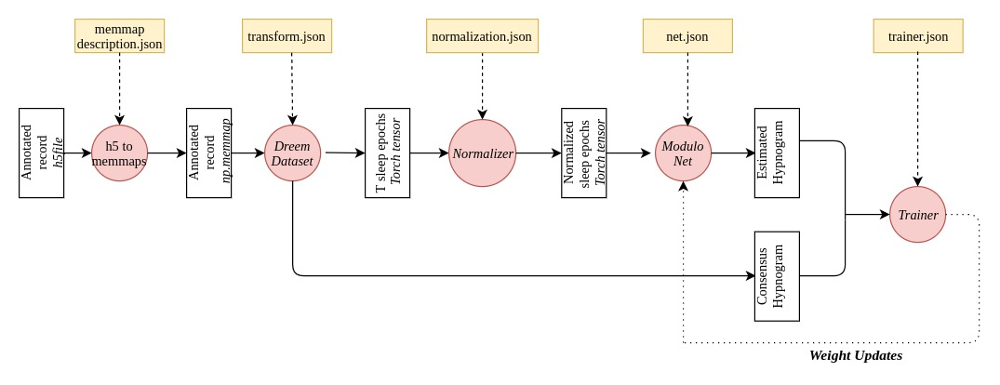
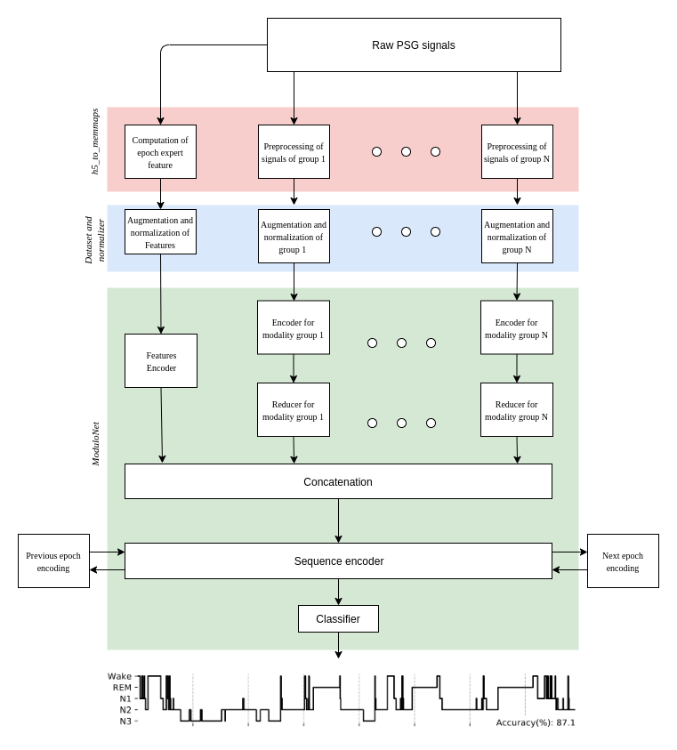

# DreemLearning: Sleep Staging made easy
DreemLearning is a sleep-staging library to reproduce the results from CITER PAPIER. It can also easily be extended to handle new datasets and to build new sleep staging model.
The library handles all the steps of sleep staging pipeline, like data loading, preprocessing, normalization, model training on a labeled dataset and inference on an unlabeled dataset.

## Prerequisites
The library was built using python 3.6. A requirements.txt file is
included with all the required python libraries. The data can be
downloaded from AWS using the script _download_data.py_ .


A setting.py file has to be created at the root of the library before
installation, the file should closely follow the format of the provided
settings_template.py file.

```python
BASE_DIRECTORY = "/data/"
BASE_DIRECTORY_H5 = BASE_DIRECTORY + "h5/"
BASE_DIRECTORY_MEMMAP = BASE_DIRECTORY + "memmap/"
EXPERIMENTS_DIRECTORY = BASE_DIRECTORY + 'experiments/'

DODH_SETTINGS = {
    'h5_directory': BASE_DIRECTORY_H5 + 'dodh/',
    'memmap_directory': BASE_DIRECTORY_MEMMAP + 'dodh/'
}

DODO_SETTINGS = {
    'h5_directory': BASE_DIRECTORY_H5 + 'dodo/',
    'memmap_directory': BASE_DIRECTORY_MEMMAP + 'dodo/'
}


```
The file defines the directory where the records are stored and where the h5 and the memmaps will be saved. These files can be large (up to 1Go per record).

## Pipeline overview

The inference pipeline is divided into 5 steps:
1. **H5 Preprocessing**: Each record needs to be an h5 file. The signals can be merged and processed into different groups. Each group is saved as a memmap file and some configuration files are added for each records. The selected signals and features from the record can be processed at that step.
2. **Dataset object**: Given several records with the same memmaps format, the DreemDataset class parses these memmaps. It builds reference to these memmaps for fast and concurrent access during the training process. The DreemDataset "returns" the data for a specific sleep epoch (a dict of torch tensor, each tensor represents a modality) and the consensus scoring for this epoch (if applicable).
3. **Normalizer**: Each modality is normalized. Normalization operations include clipping, spectrogram computations, centering, ... they are operations that are fast enough to be run during training.
4. **ModuloNet**: The class defines a specific network topology general enough to represent most of the sleep staging architectures. The user can provide the specific modules to be used in the network and the normalizer that will normalize the network input.
5. **Trainer**: Given a ModuloNet, a DreemDataset and a trainer configuration, the Trainer will train the ModuloNet on the DreemDataset. Train, validation and test dataset can be specified by using several datasets.

Fig 1. shows the overall inference pipeline, Fig 2. adds the Trainer and its retroaction on the model during training.

<div align="center">
<figure>
<figcaption><em>Fig 1: Inference Pipeline</em></figcaption>
<div align="center">

    </div>
</figure>
</div>


<br>

<figure>
<div align="center">
<figcaption><em>Fig 2: Training Pipeline</em></figcaption>
</div>
<div align="center">

    </div>
</figure>
</div>

## Download of DOD-O and DOD-H

DOD-O and DOD-H can be downloaded using the download_data.py script in this repository. They are also available in GUI here:
https://dreem-dod-o.s3.eu-west-3.amazonaws.com/index.html and 
https://dreem-dod-h.s3.eu-west-3.amazonaws.com/index.html.
The annotations are in: [Octave evaluation repository](https://github.com/Dreem-Organization/dreem-learning-evaluation).
The records will be queried from S3 and saved under .h5 format. Each h5 is in the following format:
* Hypnogram: Array
* Signals: 
   * Signal 1: Array 
    * Signal 2: Array 
    * ...: 
   * Signal N: Array 

Any h5 with the same format can be used in the pipeline. 

The following numerotation of sleep stages is used in the hypnogram: {-1: “NOT SCORED", 0:"WAKE", 1: "N1", 2:"N2", 3:"N3", 4:"REM"}.

Unlabeled hypnogram can be used by using an array of zero as an hypnogram or by specifying no hypnogram. -1 in the hypnogram epochs which could not be scored due to signal quality.

## Memmaps creations and preprocessing
The memmaps creation is done using the preprocessings.h5_to_memmaps function. The function requires the list of the records to process, 
and the memmap description. The memmap description describes the preprocessing and grouping operations to be applied to the signals. It also describes the expert features to compute: the signal(s) to use for computation and the type of computation to apply.
Once run, h5_to_memmaps build a folder which contains the formatted records, and .json describing the dataset.

This configuration is contained in a dict of the following form:


```json
{
    "dataset": "dodh",
    "signals": [
      {
        "name": "eeg",
        "signals": [
          "signals/eeg/C3_M2",
          "signals/eeg/F4_M1",
          "signals/eeg/F3_F4",
          "signals/eeg/F3_M2",
          "signals/eog/EOG1",
          "signals/eog/EOG2"
        ],
        "processings": [

          {
            "type": "filter",
            "args": {}
          },
          {
            "type": "resample",
            "args": {
              "target_frequency": 100
            }
          },
          {
            "type": "padding",
            "args": {
              "padding_duration": 900,
              "value": 0
            }
          }
        ]
      }
    ],
    "features": [
      {
        "name": "epoch_index",
        "processing": {
          "type": "index_window",
          "args": {
            "increment_duration": 30,
            "padding_duration": 900
          }
        },
        "signals": [
          "signals/eeg/F4_O2"
        ]
      },
      {
        "name": "epoch_cycle_index",
        "processing": {
          "type": "cycle_index_window",
          "args": {
            "increment_duration": 30,
            "padding_duration": 900
          }
        },
        "signals": [
          "signals/eeg/F4_O2"
        ]
      }
    ]
  }
```
"signals" defines the list of modalities. Each modality is defined by the list of path to  input signals and the processings to apply to these signals. Signals within a modality need to have the same frequency, the same length and the same padding. 
This has been designed for a maximum flexibility, it is easy to split the signals into different modalities and to use different processings and epoch encoders.
However, in the paper and in the following examples, a single modality is used most of the time.

The following preprocessings are available: *filter, resample, pad_signal*.


"feature" defines the list of expert features to compute. Each features is defined by the type of feature to compute, the argument to use to compute this feature and the signal on which the feature should be computed.
The following features are available: *index_window, cyclic_index_window, fft, signal_statistics, shannon_entropy, spectral_power.*


## Dataset Creation
*datasets.dataset.DreemDataset* defines a dataset class suitable for sleep staging. It takes the following arguments:
* records (str): path to the memmap folder of the records to include in the Dataset
* temporal_context (int): number of sleep epochs to use for sleep staging. 
* temporal_context_mode (str): way to handle the temporal context, 'sequential' (each epoch is encoded independently then processed by the sequence encoder),  or 'concatenated' (the inputs are concatenated, their concatenation is encoded). 
* groups_description (dict): dictionaries which describe the shape of the signals. The corresponding json (groups_description.json) can be found at the root of the output folder of h5_to_memmap.
* features_description (dict): dictionaries which describe the shape of the features. The corresponding json (features_description.json) can be found at the root of the output folder of h5_to_memmap.
* transform_parameters (list): specifies augmentations to be applied during **training** on the input. 
```json
[
  {
    "name": "eeg",
    "processing": [
      {
        "type": "kill_channel",
        "args": {
          "p": 0.5
        }
      }
    ]
  }
]
```

The class only keeps the epoch with sufficient temporal context and sleep stage value between 0 and 4. Data can be queried with two methods, *get_item* (which mixes all the record) and *get_record* which outputs the consecutive sleep epochs from a given record.

## Normalization Pipeline
Normalization operations are models specific operations applied to ensure that the input data is within the model definition range. The operations are implemented in Pytorch, and simple enough to be run on-the-fly during training. 

Available normalization operations are : *clip*, *affine* (affine rescaling of the signal), *standardization* (0-mean, 1-variance centering), *spectrogram* (compute the spectrogram signal-wise), *clip_and_scale*. Normalization are applied according to their order of appearances. 
When operations have to be initialized (like *standardization*), the initialization is done over the training set after the previous normalization steps have been applied.

```json
{
  "signals": [
    {
      "name": "eeg",
      "normalization": [
        {
          "type": "clip_and_scale",
          "args": {
            "min_value": -500,
            "max_value": 500
          }
        },
        {
          "type": "spectrogram",
          "args": {
            "logpower": true,
            "window_duration": 2,
            "window_overlap": 1,
            "fs": 100,
            "clamp": 1e-20
          }
        },
        {
          "type": "standardization",
          "args": {}
        }
      ]
    }
  ],
  "features": []
}
```


## ModuloNet configuration
The *ModuloNet* class allows defining and training flexible deep learning architecture for sleep staging. Most of the recent approaches can be implemented using this paradigm. Specifics epochs encoder have to be defined for each of the group of signals. Similarly, a specific encoder have to be defined for the features. 
Then a reducer is applied to the output of the epochs encoder, the reducer is used to remove the temporal dimension. Then, the encoded epochs and the features are concatenated.
If the temporal context is greater than one, they are processed by a sequence encoder.


<figure>
<div align="center">
<figcaption><em>Fig 3: Modulo Net architecture</em></figcaption>
</div>
<div align="center">

    </div>
</figure>
</div>

Here is an example of a configuration file for SimpleSleepNet:
```json
{
  "n_class": 5,
  "output_mode": "many",
  "eval_output_mode": "many",
  "type": "modulo_net",
  "encoders": {
    "eeg": {
      "type": "SimpleSleepEpochEncoder",
      "args": {
        "hidden_layers": 25,
        "filter_dim": 30,
        "dropout": 0.5,
        "bidir": true
      }
    }
  },
  "reducer": {
    "type": "AttentionReducer",
    "args": {
      "context_size": 25
    }
  },
  "features_encoder": {
    "type": "FullyConnected",
    "args": {
      "layers": [
        5
      ]
    }
  },
  "sequence_encoder": {
    "type": "ResidualGRUSequenceEncoder",
    "args": {
      "cells": 25,
      "dropout": 0.5,
      "bidir": true,
      "layers": 2
    }
  }
}
```
The following epoch encoders are available *SeqSleepEpochEncoder*,
    *DeepSleepEpochEncoder*,
    *SimpleSleepEpochEncoder*,
    *ChambonEpochEncoder*,
    *TsinalisEpochEncoder*,
    *SimpleSleepNetEpochEncoderWithoutChannelRecombination*,
    *SimpleSleepNetEpochEncoderWithoutFrequencyReduction*,
    
The following reducers are available: *AttentionReducer*, *PoolReducer*, *FlattenReducer*

The following sequence encoder are available: *GRUSequenceEncoder*, *LSTMSequenceEncoder*, *ResidualGRUSequenceEncoder*, *TemporalFlattener* (to be used when input_temporal_context is greater than 1), *DeepSleepNetResidualSequenceEncoder*.

ModuloNet can be saved and load under .gz format using *.load* and *.save* methods.

## Training 
Training is handled by the *Trainer* class. The trainer is defined upon a ModuloNet and update its weights during the training loop given a DreemDataset.
The arguments provided to the trainer are similar to the ones used by trainers from other libs:
```json
{
    "epochs": 100,
    "patience": 15,
    "optimizer": {
      "type": "adam",
      "args": {
        "lr": 1e-3
      }
    }
  }
```


## Logger and wrapping of all the steps
The package also provides a *log_experiment* class which applies the complete pipeline given the ".json" config files defined above (
*memmaps.json, transform.json,normalization.json, trainer.json, net.json*) and a list of h5 records:

```python
from dreem_learning_open.logger.logger import log_experiment
from dreem_learning_open.utils.train_test_val_split import train_test_val_split
from dreem_learning_open.settings_template import DODO_SETTINGS
import json
import os


memmap_description = json.load(open('scripts/base_experiments/simple_sleep_net/memmaps.json'))[0]
normalization = json.load(open('scripts/base_experiments/simple_sleep_net/normalization.json'))
trainer = json.load(open('scripts/base_experiments/simple_sleep_net/trainer.json'))
transform = json.load(open('scripts/base_experiments/simple_sleep_net/transform.json'))
net = json.load(open('scripts/base_experiments/simple_sleep_net/net.json'))
records = ["{}/{}/".format('path_to_records',record) for record in os.listdir('path_to_records') ]
temporal_context, input_temporal_context = 21, 1

train_records, val_records, test_records = train_test_val_split(records, 0.6, 0.2,
                                                                     0.2,
                                                                     seed=2019)
experiment_description = {
                    'memmap_description': memmap_description,
                    'dataset_settings': DODO_SETTINGS,
                    'trainer_parameters': trainer,
                    'normalization_parameters': normalization,
                    'net_parameters': net,
                    'dataset_parameters': {
                        'split': {
                            'train': train_records,
                            'val': val_records,
                            'test': test_records
                        },
                        'temporal_context': temporal_context,
                        'input_temporal_dimension': input_temporal_context,
                        'transform_parameters': transform

                    },
                    'save_folder': "my_experiment_folder"

}

experiment_folder = log_experiment(**experiment_description, parralel=True)

```

*folder* contains all the model checkpoints over the epochs, a description file which describes the model performances and parameters used to train the model.

## Inference on new records
Given a trained ModuloNet and a list of records, the inference pipeline (Fig. 1) can be used to estimate the sleep staging.
The different stages can either be performed one by one:


```python


    from dreem_learning_open.datasets.dataset import DreemDataset
    from dreem_learning_open.models.modulo_net.net import ModuloNet
    from dreem_learning_open.trainers import Trainer
    from dreem_learning_open.preprocessings.h5_to_memmap import h5_to_memmaps
    import json
    import os
    memmaps_description = json.load("memmaps_description.json") # As defined above
    records_h5_folder = 'records/h5/'
    records_memmaps_folder = 'records/memmaps/'
    output_memmap_folder,groups_description,features_description = h5_to_memmaps(records_h5_folder,records_memmaps_folder,memmaps_description)
    
    net = ModuloNet.load('model.gz')
    trainer_parameters = {
            "epochs": 100,
            "patience": 15,
            "optimizer": {
              "type": "adam",
              "args": {
                "lr": 1e-3
              }
            }
          }
    trainer = Trainer(net=net,
                      **trainer_parameters
                      )
    
    
    dataset_test = DreemDataset(groups_description, features_description=features_description,
                                temporal_context=21,
                                records=["{}/{}/".format(output_memmap_folder,record) for record in os.listdir(output_memmap_folder) ])
    performance_on_test_set, _, performance_per_records, hypnograms = trainer.validate(dataset_test,
                                                                                       return_metrics_per_records=True,
                                                                                       verbose=True)
                                                                                       

```

They can also be wrapped into a single stage:

```python


    from dreem_learning_open.datasets.dataset import DreemDataset
    from dreem_learning_open.logger.logger import evaluate_experiment_on_records
    import json
    from dreem_learning_open.preprocessings.h5_to_memmap import h5_to_memmaps
    import os
    memmaps_description = json.load("memmaps_description.json") # As defined above
    records_h5_folder = 'records/h5/'
    records_memmaps_folder = 'records/memmaps/'
    output_memmap_folder,groups_description,features_description = h5_to_memmaps(records_h5_folder,records_memmaps_folder,memmaps_description)
    records_to_eval = [output_memmap_folder + '/ '+ record for record in os.listdir(output_memmap_folder)]
    evaluate_experiment_on_records(records_to_eval,experiment_folder)

```

## Replication of the paper experiments
The description files used to train the model from the papers can be
found in *script/*. To replicate an experiment, first the data have to
be downloaded using
[octave-evaluation](https://github.com/Dreem-Organization/octave_evaluation)
and the *settings.py* has to be configured properly
(*settings-template.py* can be used as a template). The experiment can
be run using *run_base_experiments.py*, *run_learning_curve* (number of
training records vs model performance), *run_transfer_learning.py*, ... 

## Dreem-learning dockerisation
*dreem-learning* can be be packaged and ran within a docker with *start_docker.sh* or can be build using the provided Dockerfile and run:
```shell script
sudo docker run -it --cpuset-cpus="1-4" --gpus '"device=1"' -v "/home/$USER/data:/data" dreem-learning python scripts/run_experiments.py
```

## Credits:
The code used for the LSTM with recurrent batch norm is from the
[pytorch benchmark repository](https://github.com/pytorch/benchmark)

The code used for the regularization framework is from
[PyTorchReg](https://github.com/dizam92/pyTorchReg/)
